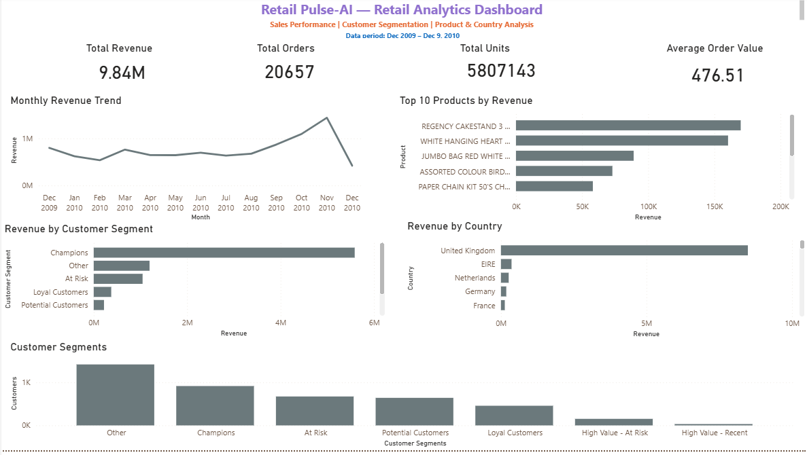

# RetailPulse-AI 📊

A retail analytics project that transforms transactional sales data into actionable business insights using **Python, PostgreSQL, SQL, and Power BI**.

The project covers the complete analytics workflow — from data cleaning and quality validation to dimensional data modeling, customer RFM segmentation, SQL analytics, and an interactive Power BI dashboard.

---

## 🎯 Project Overview

RetailPulse-AI analyzes retail transaction data to answer key business questions:

- How is revenue changing over time?
- Which products generate the highest revenue?
- Which countries contribute the most revenue?
- Who are the highest-value customers?
- Which customers may be at risk of becoming inactive?
- How are customers distributed across RFM segments?

The project was designed as an end-to-end **Data Analytics / Business Intelligence portfolio project**.

---

## 💼 Business Problem

Retail businesses generate large volumes of transaction data, but raw transaction records do not directly provide useful business insights.

The objective of RetailPulse-AI is to transform raw transactional data into a structured analytics system that enables stakeholders to understand:

- Sales performance
- Product performance
- Geographic performance
- Customer behavior
- Customer value
- Customer engagement

---

## 🎯 Project Objectives

1. Clean and validate raw retail transaction data.
2. Handle duplicate records and missing values.
3. Separate valid sales transactions from non-sales/operational records.
4. Build a PostgreSQL analytical data warehouse.
5. Create reusable SQL analytics views.
6. Perform customer RFM analysis.
7. Segment customers based on Recency, Frequency, and Monetary value.
8. Build an interactive Power BI dashboard.
9. Validate dashboard metrics against PostgreSQL.
10. Extract business insights from the analyzed data.

---

# 📂 Dataset

**Dataset:** Online Retail II

The raw dataset contains retail transactions with fields including:

- Invoice
- StockCode
- Description
- Quantity
- InvoiceDate
- Price
- Customer ID
- Country

### Data period

**December 2009 – December 9, 2010**

> Note: December 2010 is a partial month because the dataset ends on December 9, 2010.

---

# 🧹 Data Cleaning & Quality

The raw dataset contained:

- **525,461** rows
- **6,865** exact duplicate rows
- Missing product descriptions
- Missing customer IDs
- Negative quantities
- Zero-price transactions
- Operational/service-related stock codes

### Duplicate handling

Exact duplicate rows were removed.

```text
Raw rows:              525,461
Duplicate rows:          6,865
Rows after deduplication: 518,596


# 📊 Power BI Dashboard

The Power BI dashboard provides an executive overview of retail performance.



### KPI Cards

- Total Revenue
- Total Orders
- Total Units
- Average Order Value

### Dashboard Visuals

#### 1. Monthly Revenue Trend

Shows revenue movement from:

**Dec 2009 → Dec 2010**

#### 2. Top 10 Products by Revenue

Identifies the products generating the highest merchandise revenue.

#### 3. Revenue by Customer Segment

Compares revenue contribution across RFM segments.

#### 4. Revenue by Country

Shows geographic revenue distribution.

#### 5. Customer Segments

Shows the number of customers in each RFM segment.